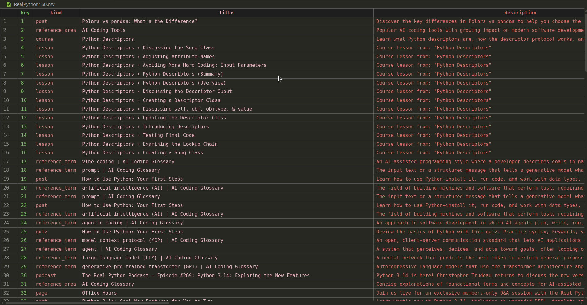

# THECODEZ - RealPython Web Scraper

Welcome to **THECODEZ** — a Python-based web scraper and data extractor focused on scraping the latest tutorials from [RealPython](https://realpython.com).

---

## Project Overview

This project automates data collection from RealPython's tutorial search API. It retrieves the newest tutorials, saves the data into CSV format, and showcases a branded terminal experience with a stylish animated banner.



## Folder Structure

```
/
├── src/
│   ├── tutorial_sample.md      # Sample tutorial extracted from RealPython
│   └── sample_image.png        # Example image related to extracted data
├── scraper.py                  # Main Python script for scraping & branding
├── README.md                   # This file
├── requirements.txt            # Required packages
```

---

## Sample Data

* `src/tutorial_sample.md` — contains an example tutorial text extracted by the scraper.
* `src/sample_image.png` — a sample image related to the extracted tutorial content.


---

## Requirements

* Python 3.7+
* Packages listed in `requirements.txt` (including `rich`, `pyfiglet`, `requests`, `pandas`)

---

## Customize

* Adjust the number of pages to scrape by changing the `pages` variable in `main()`.

---


